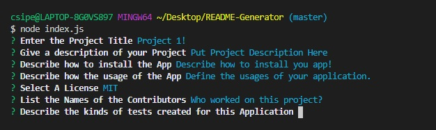

# HW9 Node.js README-Generator

## Welcome to our README Generator!
This is a great JS file which will allow you to easily create a quality README file for you application using a series of prompts. A quality README file will allow a user to learn information about the app, how to install the app and how to use the application. Depending on the application it will also include instructions on how to report issues and give instructions on how to contribute to future versions. The README generator will include the following information:

* At least one badge
* Project title
* Description
* Table of Contents
* Installation
* Usage
* License
* Contributing
* Tests
* User GitHub profile picture
* User GitHub email

# Installation
Our README generator operates in the terminal using NODE.js. which means it does not require a browser to create this file for you! To begin usage install the JSON package using NPM Install.

# Usage
Use this application for a quick and easy way to create a README for your next project!

# Preview

Built With
Microsoft Visual Studio Code

# Authors/Contributors
Christopher Sipe - UW Coding Bootcamp Student
